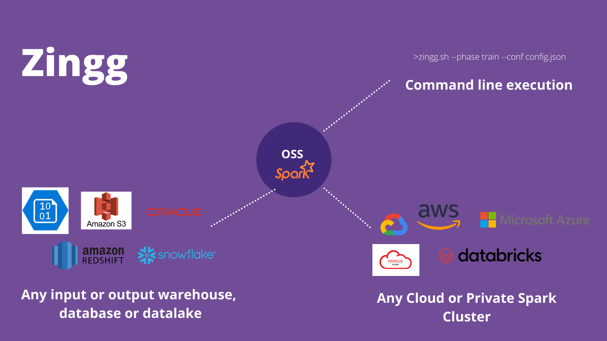

# Contents
- [Why?](#why?)
- [Connectors](docs/pipes.md)
- [Security](#security)
- [Key Zingg Concepts](#key-zingg-concepts)
- [Installation](docs/installation.md) | [Compiling from source, other Spark versions](docs/compiling.md)
- [Configuration](docs/configuration.md)
- [Running Zingg](docs/running.md) 
- [Step by step guide](docs/stepByStep.md) | [Demo](https://www.youtube.com/watch?v=zOabyZxN9b0&t=0)
- [Hardware Sizing](docs/hardwareSizing.md)
- [Pretrained models](#pretrained-models)
- Running on [Databricks](docs/databricks.md) | [Amazon EMR](docs/aws.md)
- [Acknowledgements](#acknowledgements)
- [License](#license)
- [FAQ](docs/faq.md)
- [Community](#community)
- [Contributing](#contributing)
- [Book Office Hours](#book-office-hours)

## Why?

Real world data contains multiple records belonging to the same customer. These records can be in single or multiple systems and they have variations across fields which makes it hard to combine them together, especially with growing data volumes. This hurts [customer analytics](docs/bizLeaderSurvey.md) - establishing lifetime value, loyalty programs or marketing channels is impossible when the base data is not linked. No AI algorithm for segmentation can produce right results when there are multiple copies of the same customer lurking in the data. No warehouse can live up to its promise if the dimension tables have duplicates. 

With a modern data stack and DataOps, we have established patterns for E and L in ELT for  building data warehouses, datalakes and deltalakes. However, the T - getting data ready for analytics still needs a lot of effort. Modern tools like [DBT](https://www.getdbt.com) are actively and successfully addressing this. What is also needed is a quick and scalable way to build the single source of truth of core business entities post Extraction and pre or post Loading. 

With Zingg, the analytics engineer and the data scientist can quickly integrate data silos and build unified views at scale! 

Zingg integrates different records of an entity like customer, patient, supplier, product etc in same or disparate data sources. Zingg is useful for

- Building unified and trusted views of customers and suppliers across multiple systems
- Large Scale Entity Resolution for AML, KYC and other fraud and compliance scenarios
- [Deduplication](docs/patient.md) and data quality
- Identity Resolution 
- Integrating data silos during mergers and acquisitions
- Data enrichment from external sources
- Establishing customer [households](docs/households.md)

Zingg is a no code ML based tool for data unification. It scales well to enterprise data volumes and entity variety. It works for English as well as Chinese, Thai, Japanese, Hindi and other languages.   

## Connectors

Zingg connects, reads and writes to most on-premise and cloud data sources. Zingg runs on any private or cloud based Spark service. 

Zingg can read and write to Snowflake, Cassandra, S3, Azure, Elastic, major RDBMS and any Spark supported data sources. Zingg also works with all major file formats like Parquet, Avro, JSON, XLSX, CSV, TSV etc. This is done through the Zingg [pipe](docs/pipes.md) abstraction.  

## Security

Zingg models are built on your data, deployed within your network. No data leaves your environment. 

## Key Zingg Concepts

Zingg learns 2 models on the data. 

1. Blocking Model

One fundamental problem with scaling data mastering is that the number of comparisons increase quadratically as the number of input record increases. 

Zingg learns a clustering/blocking model which indexes near similar records. This means that Zingg does not compare every record with every other record. Typical Zingg comparisons are 0.05-1% of the possible problem space.

2. Similarity Model 

The similarity model helps Zingg to predict which record pairs match. Similarity is run only on records within the same block/cluster to scale the problem to larger datasets. The similarity model is a classifier which predicts similarity of records which are not exactly same, but could belong together.

 

To build these models, training data is needed. Zingg comes with an interactive learner to rapidly build training sets. 

 

## Pretrained models

Zingg comes with pretrained models for the Febrl dataset under the [models](models) folder.

## Acknowledgements

Zingg would have not have been possible without the excellent work below:
- [Apache Spark](https://spark.apache.org)
- [SecondString](http://secondstring.sourceforge.net/)
- [Febrl](http://users.cecs.anu.edu.au/~Peter.Christen/Febrl/febrl-0.3/febrldoc-0.3/)

## License

Zingg is licensed under [AGPL v3.0](https://www.gnu.org/licenses/agpl-3.0.en.html) - which means you have the freedom to distribute copies of free software (and charge for them if you wish), that you receive source code or can get it if you want it, that you can change the software or use pieces of it in new free programs, and that you know you can do these things.

Need a different license? Write to us.

## Community

Be part of the conversation in the [Zingg Community Slack](https://join.slack.com/t/zinggai/shared_invite/zt-w7zlcnol-vEuqU9m~Q56kLLUVxRgpOA)

## Reporting bugs and contributing 

Want to report a bug or request a feature? Let us know on  [Slack](https://join.slack.com/t/zinggai/shared_invite/zt-w7zlcnol-vEuqU9m~Q56kLLUVxRgpOA), or open an [issue](https://github.com/zinggAI/zingg/issues/new/choose)

Want to commit code? Lets talk on  [Slack](https://join.slack.com/t/zinggai/shared_invite/zt-w7zlcnol-vEuqU9m~Q56kLLUVxRgpOA)

## Book Office Hours
If you want to schedule a 30-min call with our team to help you get set up, please select some time directly [here](https://calendly.com/sonalgoyal/30min)

