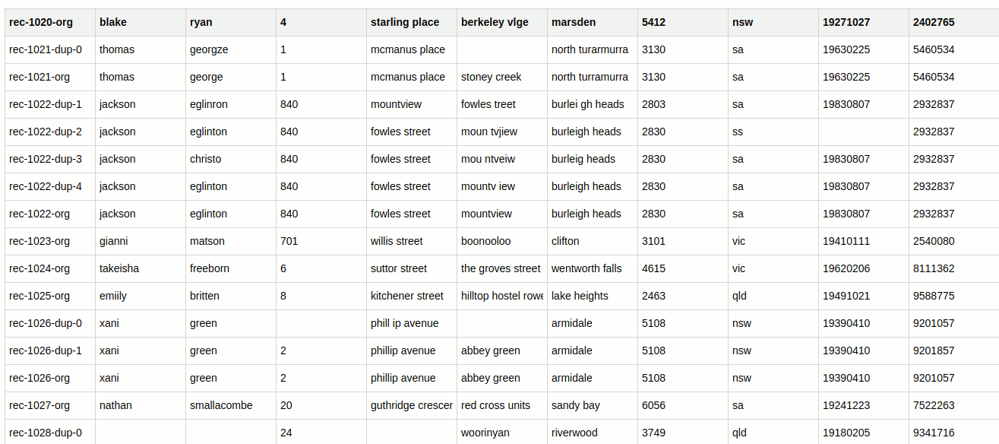
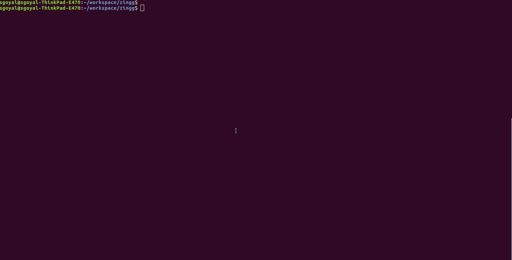

## Why?

Real world data contains multiple records belonging to the same customer. These records can be in single or multiple systems and they have variations across fields which makes it hard to combine them together. And as the number of records increase, the complexity of matching them with each other increases too. This hurts customer analytics - establishing lifetime value, loyalty programs or marketing channels is impossible when the base data is unlean. No AI algorithm for segmentation can produce right results when there are multiple copies of the same customer lurking in the data. No warehouse can live upto its promise if the dimension tables have duplicates. It is the same story with suppliers and other entities. 

Through DataOps, we have come a long way with established patterns for E and L in ETL for  building data warehouses, datalakes and deltalakes. However, the T - getting data ready for analytics still needs a lot of work.

With Zingg, we promise to change that!


Zingg integrates different records of an entity like customer, supplier, product etc in same or disparate data sources. Zingg can be used for

- Master Data Management - building unified and trusted views of customers and suppliers across multiple systems
- Large Scale Entity Resolution for fraud and compliance
- Deduplication and data quality
- Integrating data silos during mergers and acquisitions
- Reference Data Management
- Data enrichment from external sources

Zingg is a no-code way for BI engineers, data analysts and scientists to quickly intergate data silos and build unified views.

## Key Zingg Concepts

For data mastering, Zingg learns 2 models from the training data. 

1. Blocking Model

One fundamental problem will scaling data mastering is that the number of comparisons increase quadratically as the size of input record increases. A blocking model helps Zingg to index close records together, so that it does not compare every record with every other record. 


Zingg learns a clustering model to index near similar records together to avoid this problem. Typical Zingg comparisons are 0.05-1% of the possible problem space.


2. Similarity Model 

Similarity model helps Zingg to predict which records are similar to each other. Similarity is run only on records within the same block to scale the problem to larger datasets. The similarity model is a classifier which predicts similarity of records wchich are not exactly same, but could belong together.

 

To build these models, training data is needed. Zingg comes with an interactive learner to rapidly build training sets. 

## Zingg Installation

Zingg runs on [Spark](https://spark.apache.org) and can be used on all major Spark distributions. Zingg can run on all major Linux flavours.

The follwing steps assume that Zingg is being installed on a Ubuntu environment at /home/ubuntu. For other Linux flavours, please replace /home/ubuntu with location of your home folder.

### Prerequisites 
A) Java JDK - version "1.8.0_131" 

B) Apache Spark - version spark-3.0.1-bin-hadoop2.7 

#### Prerequisites for running Zingg on single machine without setting up a Spark cluster
(Good for a few million records)
A) Install the specified JDK version

B) Apache Spark - Download the specified version from spark.apache.org and unzip it at a folder under home 

Please add the following entries to ~/.bash_aliases 

>export JAVA_HOME=path to jdk-11.0.9

>export SPARK_HOME=path to spark-3.0.1-bin-hadoop2.7

>export SPARK_MASTER=local[*]

C) Correct entry of host under /etc/hosts 

Run ifconfig to find the ip of the machine and make sure it is added to the /etc/hosts for localhost 

#### Prerequisites for running Zingg on a Spark cluster
If you have a ready Spark cluster, you can run Zingg by configuring the following environment on your driver machine
export JAVA_HOME=path to jdk-11.0.9

>export SPARK_HOME=path to spark-3.0.1-bin-hadoop2.7

>export SPARK_MASTER=spark://master-host:master-port


### Installation Steps 

Download the tar zingg-version.tar.gz to a folder of your choice and run the following 

>gzip -d zingg-0.3.0-SNAPSHOT-bin.tar.gz ; tar xvf zingg-0.3.0-SNAPSHOT-bin.tar 

This will create a folder zingg-0.3.0-SNAPSHOT under the chosen folder. 
 
Move the above folder to zingg. 

>mv zingg-0.3.0-SNAPSHOT-bin ~/zingg 

export ZINGG_HOME=path to zingg

export PATH=$PATH:$JAVA_HOME/bin:$SPARK_HOME/bin:$SPARK_HOME/sbin:ZINGG_HOME/scripts 
 
Run bash and print the aliases to ensure that they are set correctly. 

>bash 

>echo $SPARK_HOME 

>echo $JAVA_HOME 

>java --version 

>echo $ZINGG_HOME 

 
Let us now run a sample program to ensure that our installation is correct 

>cd zingg 

>./scripts/zingg.sh --phase match --conf examples/febrl/config.json  

The above will find duplicates in the examples/febl/test.csv file. You will see Zingg logs on the console and once the job finishes, you will see some files under /tmp/zinggOutput with matching records sharing the same cluster id.


Congratulations, Zingg has been installed! 

## Zingg Configuration

 Zingg comes with a command line script that invokes spark-submit. This script needs a json configuration file to define the input data and match types, location of training data, models and output. 

Sample configuration files are defined at examples/febrl and examples/febrl120k

Here are the json variables which you will need to define to work with your data.

### data

Array of input data. If the data is self describing, for eg avro or parquet, there is no need to define the schema. Else field definitions with name and types need to be provided. Different formats are csv, jdbc, parquet and avro.

For example for the csv under examples/febrl 

```json
 "data" : [ {
    "name" : "test",
    "format" : "csv",
    "props" : {
      "delimiter" : ",",
      "header" : "true",
      "location" : "/home/ubuntu/zingg/examples/febrl/test.csv"
    },
    "schema" : "{
      \"type\":\"struct\",
      \"fields\":[
      {\"name\":\"id\",\"type\":\"string\",\"nullable\":true,\"metadata\":{}},
      {\"name\":\"firstName\",\"type\":\"string\",\"nullable\":true,\"metadata\":{}},
      {\"name\":\"lastName\",\"type\":\"string\",\"nullable\":true,\"metadata\":{}},
      {\"name\":\"streetnumber\",\"type\":\"string\",\"nullable\":true,\"metadata\":{}},
      {\"name\":\"street\",\"type\":\"string\",\"nullable\":true,\"metadata\":{}},
      {\"name\":\"address1\",\"type\":\"string\",\"nullable\":true,\"metadata\":{}},
      {\"name\":\"address2\",\"type\":\"string\",\"nullable\":true,\"metadata\":{}},
      {\"name\":\"areacode\",\"type\":\"string\",\"nullable\":true,\"metadata\":{}},
      {\"name\":\"stateCode\",\"type\":\"string\",\"nullable\":true,\"metadata\":{}},
      {\"name\":\"dateOfbirth\",\"type\":\"string\",\"nullable\":true,\"metadata\":{}},
      {\"name\":\"ssn\",\"type\":\"string\",\"nullable\":true,\"metadata\":{}}
      ]
      }"
  }
```

### zinggDir

Location where trained models will be persisted. Defaults to /tmp/zingg

### modelId 

Identifier for the model. You can train multiple models which get saved under zinggDir/modelId

### fieldDefinition

Which fields from the source data to be used for matching, and what kind of matching they need. 

#### FUZZY 
Broad matches with typos, abbreviations and other variations. 

#### EXACT 
Less tolerant with variations, but would still match inexact strings to some degree. Preferable for country codes, pin codes and other categorical variables where you expect less variations

#### DONT_USE
Name says it :-) Appears in the output but no computation is done on these. Helpful for fields like ids which are required in the output.


````json
"fieldDefinition" : [ {
    "matchType" : "DONT_USE",
    "fieldName" : "id",
    "fields" : "id"
  },
  { 
    "matchType" : "FUZZY",
    "fieldName" : "firstName",
    "fields" : "firstName"
  }
  ]
````

Here, fields id from input are output in the final results.   

### numPartitions
Number of Spark partitions over which the input data is distributed. Keep it equal to the 20-30 times the number of cores. This is an important configuration for performance.

### labelDataSampleSize
Fraction of the data to be used for training the models. Adjust it between 0.0001 and 0.1 to keep the sample size small enough so that it finds enough edge cases fast. If the size is bigger, the findTrainingData job will spend more time combing through samples. If the size is too small, Zingg may not find the right edge cases.

## Zingg Phases
Zingg runs Spark jobs for building training data(findTrainingData and label), building actual models(train) and applying these models on the data to get mastered entities(match). If you need to match records in one dataset against other, you can run the link phase. The phase to be run is passed as a command line argument. Here are some more details about the phases and how they can be invoked.

### findTrainingData - finding pairs of records which could be similar to train Zingg
Zingg builds models to predict similarity. Training data is needed to build these models. The findTrainingData phase prompts Zingg to search for edge cases in the data. During findTrainingData, Zingg combs through the data samples and judiciously selects limited pairs for the user to mark. Zingg is very frugal about the training so that user effort is minimized and models can be built and deployed quickly.

This findTrainingData job writes the edge cases to the folder configured throgh zinggDir/modelId in the config. 

`./zingg.sh --phase findTrainingData --conf config.json`

### label - user feedback on the training pairs 
This phase opens an interactive learner where the user can mark the pairs found by findTrainingData phase as matches or non matches. 

`./zingg.sh --phase label --conf config.json`

 

The findTrainingData phase is run first and then the label phase is run and this cycle repeated so that the Zingg models get smarter from user feedback.This generates edge cases for labelling and the user marks them. At each stage, the user will get different variations of attributes across the records. 

 

Proceed till you have at least 30-40 positives, or when you see the predictions by Zingg converging with the output you want. Zingg performs pretty well with even small number of training, as the samples are chosen by the algorithm itself. 

### train - training and saving the models
Builds up the Zingg models using the training data from the above phases and writes them to the folder zinggDir/modelId as specified in the config.

`./zingg.sh --phase train --conf config.json`

### match
Finds the records whioch match with each other. Matching records are given the same z_cluster id. Each record also gets a z_minScore and z_maxScore which shows the least/greatest it matched with other records in the same cluster. 

`./zingg.sh --phase match --conf config.json`


### link

In many cases like reference data mastering, enrichment etc, 2 individual datasets are duplicate free but they need to be matched against each other. The link phase is used for such scenarios.

`./zingg.sh --phase link --conf config.json`


## Hardware Sizing 
Zingg has been built to scale. Performance is dependent on 
- The number of records to be matched.
- The number of fields to be compared against each other. 
- The actual number of duplicates. 

Here are some performance numbers you can use to determine the appropriate hardware for your data.
- 120k records of examples/febrl120k/test.csv take 5 minutes to run on a 4 core, 10 GB RAM local Spark cluster.
<TODO> - Add 0.5 and 1 m specs here
- 9m records with 3 fields - first name, last name, email take 45 minutes to run on AWS m5.24xlarge instance with 96 cores, 384 gb RAM 

## Pretrained models
Zingg comes with pretrained models for the Febrl dataset under  the models folder.


## Running on AWS Elastic Map Reduce
`aws emr create-cluster --name "Add Spark Step Cluster" --release-label emr-6.2.0 --applications Name=Zingg \
--ec2-attributes KeyName=myKey --instance-type <instance type> --instance-count <num instances> \
--steps Type=Spark,Name="Zingg",ActionOnFailure=CONTINUE,Args=[--class,zingg.client.Client,<s3 location of zingg.jar>,--phase,<name of phase - findTrainingData,match etc>,--conf,<s3 location of config.json>] --use-default-roles`

## Running on Databricks
````json
{
  "name": "Zingg",
  "new_cluster": {
    "spark_version": "7.3.x-scala2.12",
    "node_type_id": "r3.xlarge",
    "aws_attributes": {
      "availability": "ON_DEMAND"
    },
    "num_workers": 5
  },
  "libraries": [
    {
      "jar": "dbfs:/zingg.jar"
    },
    {
      "maven": {
        "coordinates": "org.jsoup:jsoup:1.7.2"
      }
    }
  ],
  "email_notifications": {
    "on_start": [],
    "on_success": [],
    "on_failure": []
  },
  "timeout_seconds": 3600,
  "max_retries": 1,
  "spark_jar_task": {
    "main_class_name": "zingg.client.Client",
    "parameters": [
    "--phase",
    "findTrainingData",
    "--conf",
    "dbfs:/config.json"
  ]
  }
}
  }
}
````
## Acknowledgements

Zingg leverages 
- [Apache Spark](https://spark.apache.org)
- [SecondString](http://secondstring.sourceforge.net/)
- [Febrl](http://users.cecs.anu.edu.au/~Peter.Christen/Febrl/febrl-0.3/febrldoc-0.3/)

## License
Zingg is licensed under [AGPL v3.0](https://www.gnu.org/licenses/agpl-3.0.en.html) - which means you have the freedom to distribute copies of free software (and charge for them if you wish), that you receive source code or can get it if you want it, that you can change the software or use pieces of it in new free programs, and that you know you can do these things.

