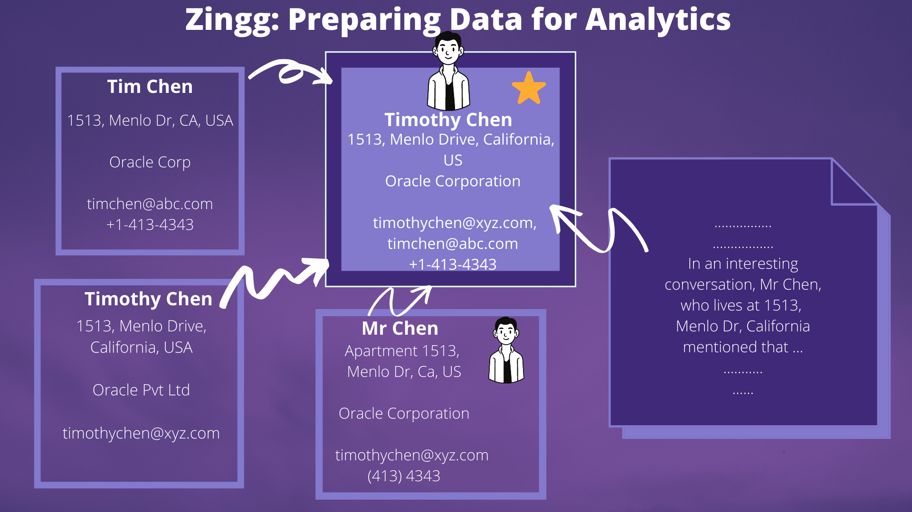

# Welcome To Zingg

This is the latest documentation for Zingg. Release wise documentation can be accessed through:

* [v0.4.0](https://app.gitbook.com/o/kn0G4kXLdlfPagjso48S/s/a7sgpR3odgfck5L8KMcN/)
* [v0.3.4](https://docs.zingg.ai/zingg0.3.4/)
* [v0.3.3](https://docs.zingg.ai/zingg0.3.3/)

## Why?

Data silos hurt all business functions - customer analytics, supplier consolidation, risk and compliance, and sales and marketing.

Zingg is a quick and scalable way to build a single source of truth for core business entities. With Zingg, the analytics engineer and the data scientist can quickly integrate data silos and build unified views at scale!

## Join Zingg Slack

The [Zingg Community Slack](https://join.slack.com/t/zinggai/shared\_invite/zt-w7zlcnol-vEuqU9m\~Q56kLLUVxRgpOA) is a gret place to discuss entity and identity resolution, seek lightning fast help on Zingg and network with peers.&#x20;

## Book Office Hours

If you want to schedule a 30-min call with our team to help you see if Zingg is a fit for your use case, please select a slot directly [here](https://calendly.com/sonalgoyal/30min).
