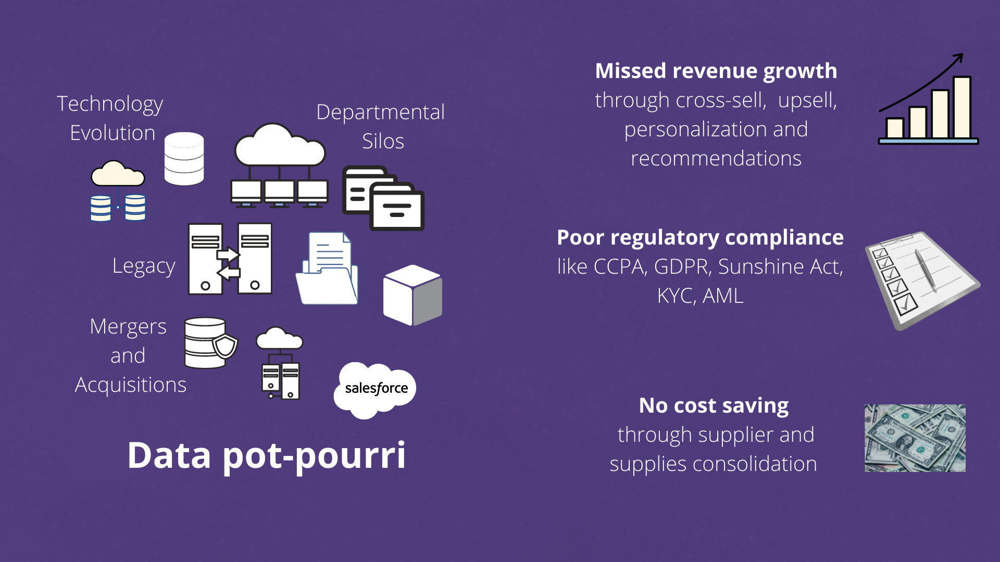
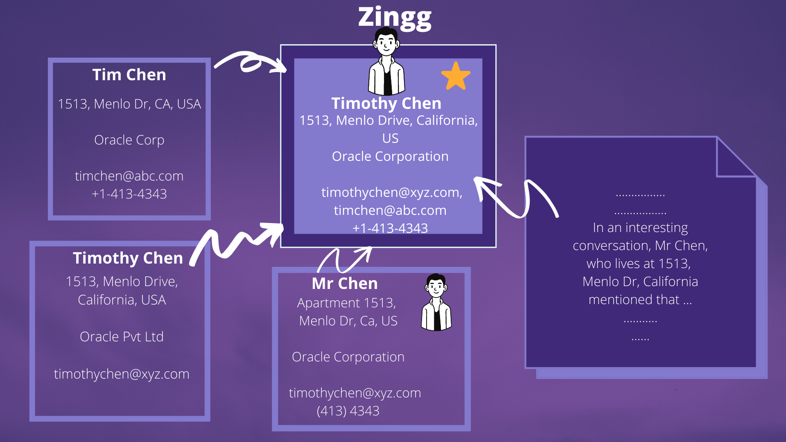

# Welcome To Zingg

This is the documentation for Zingg Enterprise v0.8 .
## Why?

Data silos hurt all business functions - customer analytics, supplier consolidation, risk and compliance, and sales and marketing.

Zingg is a quick and scalable way to build a single source of truth for core business entities. With Zingg, the analytics engineer and the data scientist can quickly integrate data silos and build unified views at scale!

<figure><figcaption></figcaption></figure>

## Ask For Help

If you want to understand if Zingg is a fit for your use case or have other questions or suggestions, join our [Slack.](https://join.slack.com/t/zinggai/shared_invite/zt-w7zlcnol-vEuqU9m~Q56kLLUVxRgpOA)

