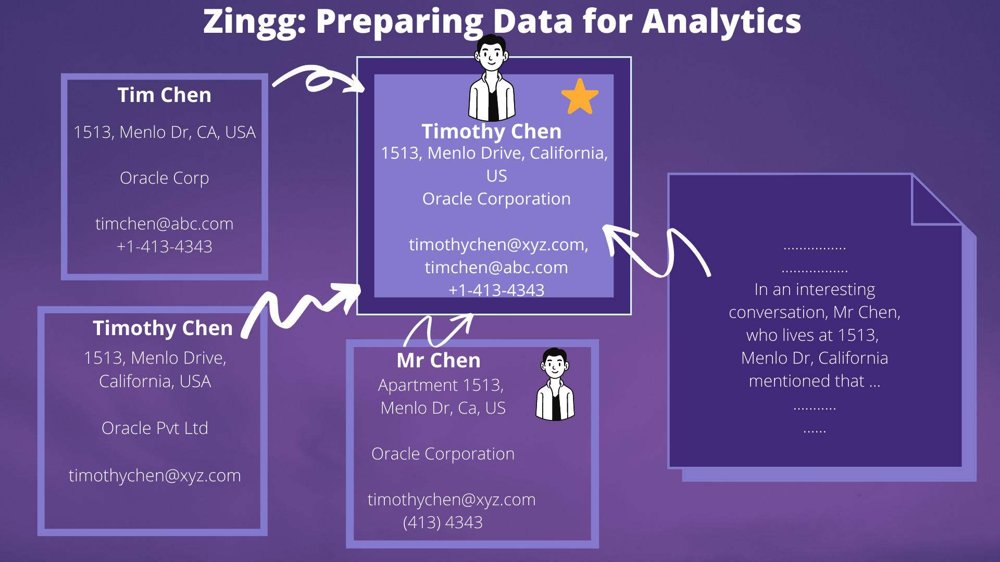

# Welcome to Zingg

This is the documentation for Zingg Community v0.4 .

## Why?

Data silos hurt all business functions - customer analytics, supplier consolidation, risk and compliance, and sales and marketing.

Zingg is a quick and scalable way to build a single source of truth for core business entities. With Zingg, the analytics engineer and the data scientist can quickly integrate data silos and build unified views at scale!

##
