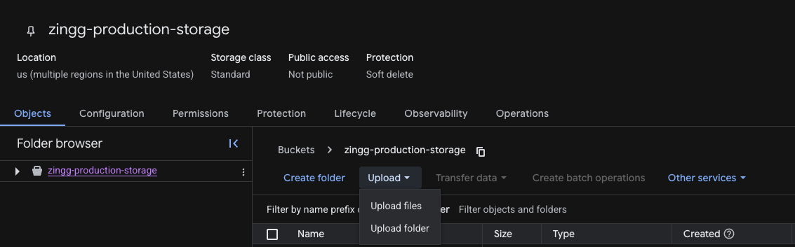
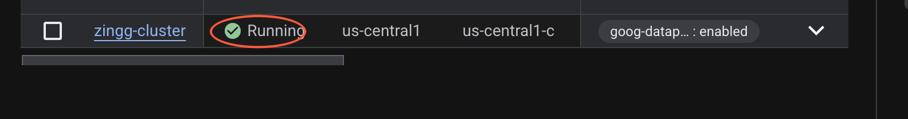
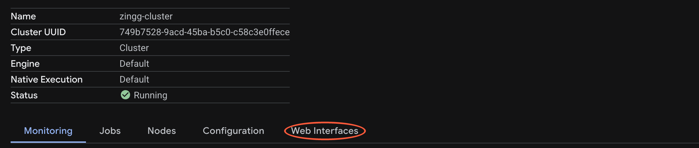
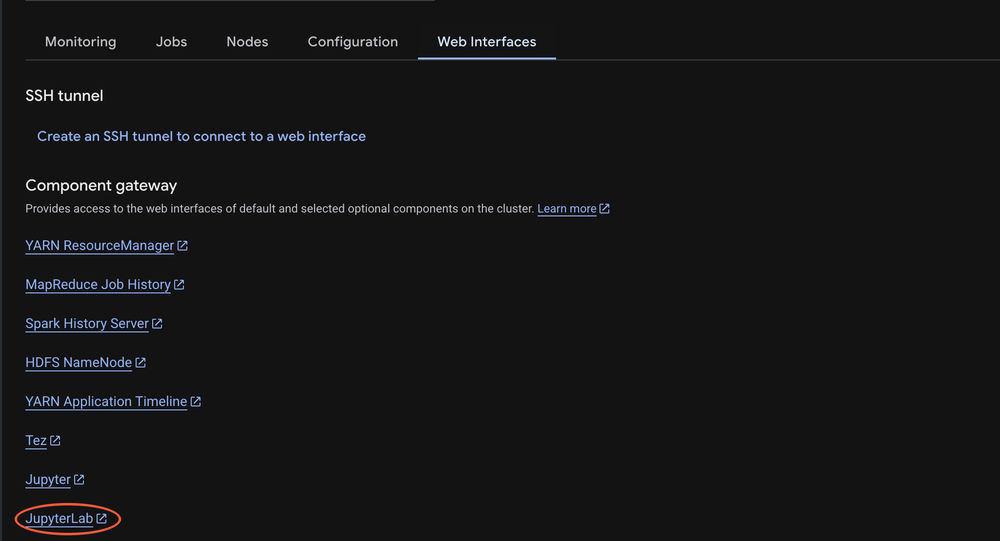
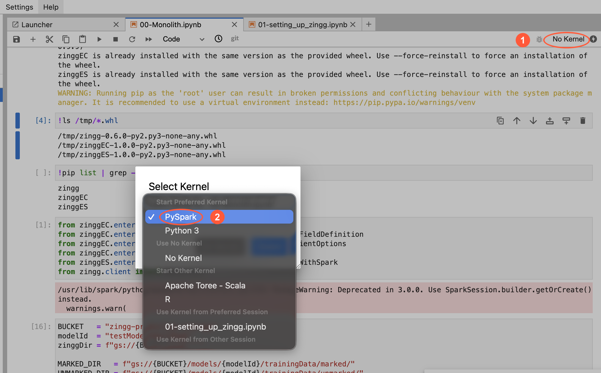
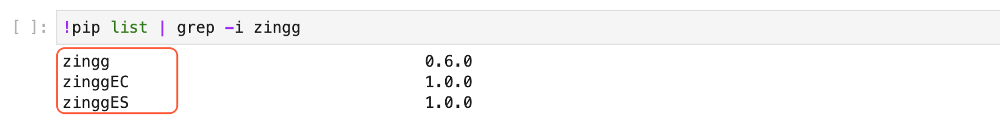

# Platform Guide for GCP Dataproc

Combining Zingg with Google Cloud gives you elastic Spark scale via Dataproc, flexible storage via GCS, and a managed JupyterLab workspace via the Component Gateway. Spin up a cluster when you need it and shut it down when the job is done.


Tested with Dataproc image version 2.2-debian12 (Spark 3.5). The `n2-standard-4` machine type with 16GB RAM per node is the recommended minimum for Zingg's training phases.



The steps below use the **Enterprise** API - `EArguments`, `EFieldDefinition`, `ECsvPipe`, and `EZinggWithSpark`. Where Community differs, both versions are shown in a tab. Everything untabbed applies to both editions.


### Before you start

Each item below blocks cluster creation or notebook setup, and the resulting error messages are not self-explanatory.

* The Compute Engine default service account (`PROJECT_NUMBER-compute@developer.gserviceaccount.com`) needs **`roles/dataproc.worker`** and **`roles/storage.objectAdmin`**. On newer projects these are not granted automatically.
* You need **`roles/dataproc.editor`** to create and manage clusters, and **`roles/iap.tunnelResourceAccessor`** if you want SSH access to the master node.
* The **Cloud Dataproc**, **Compute Engine**, and **Cloud Storage** APIs must be enabled.
* Your Dataproc cluster has **no outbound internet access** by default. Every Python package must be installed from a wheel staged in GCS — `pip install` from PyPI fails with `Network is unreachable`.

To grant the service account roles:

```bash
PROJECT=$(gcloud config get-value project)
SA="$(gcloud projects describe $PROJECT --format='value(projectNumber)')-compute@developer.gserviceaccount.com"

gcloud projects add-iam-policy-binding $PROJECT \
  --member="serviceAccount:$SA" --role="roles/dataproc.worker"

gcloud projects add-iam-policy-binding $PROJECT \
  --member="serviceAccount:$SA" --role="roles/storage.objectAdmin"
```


Wait 60 seconds after granting before creating a cluster. IAM changes propagate asynchronously, and an immediate retry reproduces the same error.

If `add-iam-policy-binding` fails with a permission error of its own, you lack `resourcemanager.projects.setIamPolicy` on the project and will need `roles/resourcemanager.projectIamAdmin` from an administrator.


### Step 1: Download JARs and prepare your GCS bucket



Enterprise requires four JARs — the Enterprise engine, your license, and the two Google connectors.

<table><thead><tr><th valign="top">JAR</th><th valign="top">Purpose</th><th valign="top">Source</th></tr></thead><tbody><tr><td valign="top"><code>zingg-enterprise-spark-1.0.0.jar</code></td><td valign="top">The Enterprise engine</td><td valign="top">Provided with your Enterprise distribution</td></tr><tr><td valign="top"><code>zingg_license.jar</code></td><td valign="top">Your Enterprise license</td><td valign="top">Provided with your Enterprise distribution</td></tr><tr><td valign="top"><code>spark-3.5-bigquery-0.44.1.jar</code></td><td valign="top">BigQuery connector</td><td valign="top"><code>github.com/GoogleCloudDataproc/spark-bigquery-connector</code></td></tr><tr><td valign="top"><code>gcs-connector-hadoop3-latest.jar</code></td><td valign="top">GCS connector</td><td valign="top"><code>docs.cloud.google.com/dataproc/docs/concepts/connectors/cloud-storage</code></td></tr></tbody></table>

You also need three Python wheels — `zinggEC` and `zinggES` from your Enterprise distribution, plus the open-source `zingg` package that they extend.



Community requires three JARs — the Zingg engine and the two Google connectors.

<table><thead><tr><th valign="top">JAR</th><th valign="top">Purpose</th><th valign="top">Source</th></tr></thead><tbody><tr><td valign="top"><code>zingg-0.6.0.jar</code></td><td valign="top">The Zingg engine</td><td valign="top"><code>github.com/zinggAI/zingg/releases</code></td></tr><tr><td valign="top"><code>spark-3.5-bigquery-0.44.1.jar</code></td><td valign="top">BigQuery connector</td><td valign="top"><code>github.com/GoogleCloudDataproc/spark-bigquery-connector</code></td></tr><tr><td valign="top"><code>gcs-connector-hadoop3-latest.jar</code></td><td valign="top">GCS connector</td><td valign="top"><code>docs.cloud.google.com/dataproc/docs/concepts/connectors/cloud-storage</code></td></tr></tbody></table>

No license JAR and no Python wheels are needed — the `zingg` package installs from PyPI.



Create a GCS bucket in the region where your Dataproc cluster will run, then upload the JARs, any wheels, and your dataset. Use either the Cloud Console or the `gcloud` CLI.

#### Cloud Console

1. Navigate to **Cloud Storage → Buckets → Create**.
2. Name your bucket with a globally unique identifier (for example `zingg-production-storage`).
3. Set **Location type** to **Region** and pick the region your Dataproc cluster will run in (for example `us-central1`).
4. Under **Choose how to control access**, select **Uniform** — this matches `--uniform-bucket-level-access` in the CLI form below.
5. Click **Create**.
6. Open the bucket and click **UPLOAD FILES**. Upload the JARs from the table above, plus the Python wheels if you are on Enterprise.
7. Click **CREATE FOLDER**, name it `data`, open it, and upload your dataset (for example `test.csv`). Step 5 reads from `gs://YOUR_BUCKET/data/`.
8. Note the exact filenames in the bucket listing — Step 2 needs them verbatim.



_**IMAGE TO BE ADDED - the bucket **creation** dialog (name field, Location type selector, access control options) for steps 1-5. Tanwi to check with team for a screenshot from a live GCS console.**_

#### gcloud CLI



```bash
BUCKET="zingg-production-storage"

gcloud storage buckets create gs://$BUCKET \
  --location=us-central1 \
  --uniform-bucket-level-access

# JARs
gcloud storage cp *.jar gs://$BUCKET/

# Enterprise wheels
gcloud storage cp zinggEC-1.0.0-py2.py3-none-any.whl gs://$BUCKET/
gcloud storage cp zinggES-1.0.0-py2.py3-none-any.whl gs://$BUCKET/

# Open-source base package the Enterprise wheels depend on
pip download zingg --no-deps -d /tmp/zingg-wheel
gcloud storage cp /tmp/zingg-wheel/*.whl gs://$BUCKET/

# Your dataset
gcloud storage cp test.csv gs://$BUCKET/data/

# Copy the exact filenames from this listing into Step 2
gcloud storage ls -l gs://$BUCKET/
```



```bash
BUCKET="zingg-production-storage"

gcloud storage buckets create gs://$BUCKET \
  --location=us-central1 \
  --uniform-bucket-level-access

# JARs
gcloud storage cp *.jar gs://$BUCKET/

# Your dataset
gcloud storage cp test.csv gs://$BUCKET/data/

# Copy the exact filenames from this listing into Step 2
gcloud storage ls -l gs://$BUCKET/
```




Bucket names are globally unique across all of GCP, so `zingg-production-storage` may already be taken — add a suffix if creation fails.

Copy JAR filenames from the `ls` output rather than typing them. A wrong path in `spark.jars` does not fail at cluster creation: the cluster starts normally and then throws `ClassNotFoundException` on your first Zingg call.

A `US` multi-region bucket works fine with a cluster in any US region — no egress charges apply.


### Step 2: Create a Dataproc cluster

All four JARs must be injected via `spark.jars` at creation time. This cannot be changed on a running cluster.

#### gcloud CLI



```bash
gcloud dataproc clusters create zingg-cluster \
  --region=us-central1 \
  --image-version=2.2-debian12 \
  --master-machine-type=n2-standard-8 \
  --worker-machine-type=n2-standard-8 \
  --num-workers=2 \
  --master-boot-disk-size=100GB \
  --optional-components=JUPYTER \
  --enable-component-gateway \
  --bucket=$BUCKET \
  --max-idle=4h \
  --scopes=cloud-platform \
  --properties="^#^spark:spark.jars=gs://$BUCKET/zingg-enterprise-spark-1.0.0.jar,gs://$BUCKET/zingg_license.jar,gs://$BUCKET/spark-3.5-bigquery-0.44.1.jar,gs://$BUCKET/gcs-connector-hadoop3-latest.jar#spark:spark.driver.memory=12g#spark:spark.executor.memory=8g#spark:spark.driver.maxResultSize=4g#spark:spark.eventLog.enabled=false#spark:spark.sql.maxPlanStringLength=8192#spark:spark.sql.shuffle.partitions=8"
```



```bash
gcloud dataproc clusters create zingg-cluster \
  --region=us-central1 \
  --image-version=2.2-debian12 \
  --master-machine-type=n2-standard-8 \
  --worker-machine-type=n2-standard-8 \
  --num-workers=2 \
  --master-boot-disk-size=100GB \
  --optional-components=JUPYTER \
  --enable-component-gateway \
  --bucket=$BUCKET \
  --max-idle=4h \
  --scopes=cloud-platform \
  --properties="^#^spark:spark.jars=gs://$BUCKET/zingg-0.6.0.jar,gs://$BUCKET/spark-3.5-bigquery-0.44.1.jar,gs://$BUCKET/gcs-connector-hadoop3-latest.jar#spark:spark.driver.memory=12g#spark:spark.executor.memory=8g#spark:spark.driver.maxResultSize=4g#spark:spark.eventLog.enabled=false#spark:spark.sql.maxPlanStringLength=8192#spark:spark.sql.shuffle.partitions=8"
```



For a single-node cluster, replace the three machine flags with:

```bash
  --single-node \
  --master-machine-type=n2-standard-8 \
```

Verify the JARs registered. If this prints fewer than four paths, delete and recreate:

```bash
gcloud dataproc clusters describe zingg-cluster --region=us-central1 \
  --format="value(config.softwareConfig.properties['spark:spark.jars'])"
```

#### Cloud Console

1. Search for **Managed Apache Spark** (formerly Dataproc), go to **Clusters**, and select **Create Cluster on Compute Engine**.
2. Under **Optional components**, check **Jupyter Notebook**.
3. Under **Component Gateway**, check **Enable component gateway**.
4. Set the node machine type to `n2-standard-8` with a 100GB boot disk.
5. Under **Customize cluster → Cluster properties**, click **+ ADD PROPERTIES**:
   * **Prefix:** `spark`
   * **Key:** `spark.jars`
   * **Value:** the four `gs://` paths, comma-separated with no spaces
6. Add the remaining properties, each with the same `spark` prefix:
   * `spark.driver.memory` = `12g`
   * `spark.executor.memory` = `8g`
   * `spark.driver.maxResultSize` = `4g`
   * `spark.eventLog.enabled` = `false`
   * `spark.sql.maxPlanStringLength` = `8192`
   * `spark.sql.shuffle.partitions` = `8`
7. Under **Scheduled deletion**, check **Delete on idle** and set 2 hours.
8. Under **Manage security**, check **Enables the cloud-platform scope for this cluster**.


**`^#^` is required in the CLI form.** It tells gcloud to use `#` rather than a comma as the `--properties` delimiter. Because `spark.jars` is itself comma-separated, omitting this splits the JAR paths into separate malformed properties. This is the single most common failure on this step.

**In the console, the Prefix dropdown is easy to miss.** Set to anything other than `spark`, the property lands in the wrong config file and Spark never reads it — the cluster builds successfully and Zingg fails later.

**The three tuning properties are not optional for Zingg workloads.**

* `spark.eventLog.enabled=false` — Dataproc writes a Spark event log to the staging bucket by default. Zingg's iterative blocking produces a very large number of stages, so that log grows enough to slow the run down or fail it.
* `spark.sql.maxPlanStringLength=8192` — Spark's default is effectively unbounded. Zingg builds deeply nested query plans, and rendering the full plan string into logs or an error message can exhaust driver heap on its own, masking the real failure.
* `spark.sql.shuffle.partitions=8` — Spark defaults to 200, far more than these data volumes need, which adds pure task overhead on a small cluster. Keep it in line with `setNumPartitions()` in Step 11.

**The license JAR must be in the bucket before the cluster boots.** `spark.jars` paths resolve when the Spark session starts, not at job submission.

**Omit `--zone`.** Dataproc then retries across zones automatically. Pinning a zone frequently produces `UNAVAILABLE ... does not have enough resources available`. If you hit this anyway, try `e2-standard-8` — a different machine family often has capacity when `n2` does not — or switch region.

**Set `--max-idle`.** The cluster deletes itself after the idle period; without it a forgotten cluster runs indefinitely.

**A failed create leaves the cluster behind** in `ERROR` state, so a retry returns `ALREADY_EXISTS`. Run `gcloud dataproc clusters delete zingg-cluster --region=us-central1 --quiet` first.

**If the console offers only "Cluster on GKE"**, use the CLI. Creation works through the API regardless of what the console displays.


### Step 3: Open JupyterLab

Once the cluster reports **Running**, access JupyterLab through the Component Gateway — no SSH or firewall configuration needed.



1. Navigate to **Dataproc → Clusters**.
2. Click your cluster name.
3. Click the **Web Interfaces** tab.
4. Under **Component Gateway**, click the **JupyterLab** link.
5. Create a new notebook and select the **PySpark** kernel.





In JupyterLab, set the kernel in two clicks:

1. Click the **kernel indicator** at the top right of the notebook toolbar — marked **1** below. It reads `No Kernel` until one is attached, and clicking it opens the Select Kernel dialog.
2. Choose **PySpark** — marked **2** — not Python 3, then confirm.

The same indicator doubles as your check: after selecting, it should read `PySpark` before you run any cell.



Or retrieve the link from the CLI:

```bash
gcloud dataproc clusters describe zingg-cluster --region=us-central1 \
  --format="value(config.endpointConfig.httpPorts)"
```


**Wait 2–3 minutes after the cluster reports `RUNNING`.** Jupyter starts after the cluster is otherwise ready, so the gateway returns **HTTP 502** until it comes up. This is normal and resolves on its own.

**Do not stop and restart the cluster.** A stop/start cycle leaves the Jupyter service down and the gateway returning 502 permanently. Delete and recreate instead, and use `--max-idle` to control cost.

**Select the PySpark kernel, not Python 3.** The PySpark kernel pre-creates a `spark` session wired to YARN. Under Python 3 there is no Spark context and every Zingg call fails. The first cell you run takes 60–90 seconds while the session initialises.

**Notebooks save to the cluster's staging bucket**, so they survive cluster deletion.


### Step 4: Install the Python packages



Enterprise ships two wheels — `zinggEC` (common) and `zinggES` (Spark). Both **subclass the open-source `zingg` package**, so all three must be installed.

```python
!gcloud storage cp gs://YOUR_BUCKET/*.whl /tmp/
!pip install /tmp/zingg-*.whl
!pip install /tmp/zinggEC-*.whl /tmp/zinggES-*.whl
```

Restart the kernel (**Kernel → Restart Kernel**), then confirm all three are present:

```python
!pip list | grep -i zingg
```

You should see `zingg`, `zinggEC`, and `zinggES`.





Community needs only the open-source `zingg` package.

```python
!gcloud storage cp gs://YOUR_BUCKET/zingg-*.whl /tmp/
!pip install /tmp/zingg-*.whl
```

Restart the kernel (**Kernel → Restart Kernel**), then confirm it is present:

```python
!pip list | grep -i zingg
```

You should see `zingg`.




**Installing only the Enterprise wheels produces `ModuleNotFoundError: No module named 'zingg'`** on the first import. `EArguments` extends `Arguments`, `EFieldDefinition` extends `FieldDefinition`, `EZinggWithSpark` extends `Zingg` — the open-source package supplies those base classes.

**`pip install zingg` from PyPI fails** on the cluster with `Network is unreachable`. Install from the staged wheel as above. If you need other packages, either stage every wheel in GCS or add a Cloud NAT gateway to the cluster's VPC.

**`ipywidgets` is pre-installed** on Dataproc 2.2 images and is required for the labeling widget. Verify with `import ipywidgets; print(ipywidgets.__version__)`.

Packages persist on the master node across kernel restarts. You only need to reinstall after deleting and recreating the cluster.


### Step 5: Set paths and a checkpoint directory

`modelId` is a unique name for this model run — Zingg uses it as the folder name under `zinggDir`. Use the same values across every step.

```python
BUCKET = "your-bucket-name"
modelId = "testModelFebrl"
zinggDir = f"gs://{BUCKET}/models"

MARKED_DIR = (
    f"gs://{BUCKET}/models/"
    f"{modelId}/trainingData/marked/"
)
UNMARKED_DIR = (
    f"gs://{BUCKET}/models/"
    f"{modelId}/trainingData/unmarked/"
)

csv_path = f"gs://{BUCKET}/data/test.csv"
output_path = f"gs://{BUCKET}/results"

checkpoint_path = f"gs://{BUCKET}/zingg_checkpoint"
spark.sparkContext.setCheckpointDir(checkpoint_path)
```

The checkpoint directory is not optional. Zingg's iterative blocking builds a deeply nested Spark query plan, and checkpointing truncates that lineage between iterations. Without it the plan grows until the driver runs out of heap.

### Step 6: Import libraries



```python
import pandas as pd
import numpy as np
import os, time, uuid
from ipywidgets import widgets, interact, GridspecLayout
import base64
import pyspark.sql.functions as fn
from google.cloud import storage

from zingg.client import *
from zingg.pipes import *

from zinggEC.enterprise.common.EArguments import EArguments
from zinggEC.enterprise.common.EFieldDefinition import EFieldDefinition
from zinggEC.enterprise.common.epipes import ECsvPipe
from zinggES.enterprise.spark.ESparkClient import EZinggWithSpark

client = storage.Client()

def cleanModel():
    """
    Clears previous training data to restart model learning from scratch.
    """
    try:
        bucket = client.get_bucket(BUCKET)
        for prefix in [
            f"models/{modelId}/trainingData/marked/",
            f"models/{modelId}/trainingData/unmarked/"
        ]:
            for blob in bucket.list_blobs(prefix=prefix):
                blob.delete()
        print("Model cleaned.")
    except Exception as e:
        print(f"Error: {str(e)}")

def count_labeled_pairs(marked_pd):
    """
    Returns positive, negative, uncertain, and total labeled pair counts.
    """
    if marked_pd.empty:
        return 0, 0, 0, 0
    n_total = len(np.unique(marked_pd['z_cluster']))
    n_positive = len(np.unique(marked_pd[marked_pd['z_isMatch'] == 1]['z_cluster']))
    n_negative = len(np.unique(marked_pd[marked_pd['z_isMatch'] == 0]['z_cluster']))
    n_uncertain = len(np.unique(marked_pd[marked_pd['z_isMatch'] == 2]['z_cluster']))
    return n_positive, n_negative, n_uncertain, n_total

def fix_void_columns(df):
    """
    Casts all-null columns to string. Spark cannot infer a type for a
    column that is entirely null, which fails the write in Step 15.
    """
    for col in df.columns:
        if df[col].apply(lambda x: x is None).all():
            print(f"{col} is all None")
            df[col] = df[col].astype(str)
    return df
```



```python
import pandas as pd
import numpy as np
import os, time, uuid
from ipywidgets import widgets, interact, GridspecLayout
import base64
import pyspark.sql.functions as fn
from google.cloud import storage

from zingg.client import *
from zingg.pipes import *

client = storage.Client()

def cleanModel():
    """
    Clears previous training data to restart model learning from scratch.
    """
    try:
        bucket = client.get_bucket(BUCKET)
        for prefix in [
            f"models/{modelId}/trainingData/marked/",
            f"models/{modelId}/trainingData/unmarked/"
        ]:
            for blob in bucket.list_blobs(prefix=prefix):
                blob.delete()
        print("Model cleaned.")
    except Exception as e:
        print(f"Error: {str(e)}")

def count_labeled_pairs(marked_pd):
    """
    Returns positive, negative, uncertain, and total labeled pair counts.
    """
    if marked_pd.empty:
        return 0, 0, 0, 0
    n_total = len(np.unique(marked_pd['z_cluster']))
    n_positive = len(np.unique(marked_pd[marked_pd['z_isMatch'] == 1]['z_cluster']))
    n_negative = len(np.unique(marked_pd[marked_pd['z_isMatch'] == 0]['z_cluster']))
    n_uncertain = len(np.unique(marked_pd[marked_pd['z_isMatch'] == 2]['z_cluster']))
    return n_positive, n_negative, n_uncertain, n_total

def fix_void_columns(df):
    """
    Casts all-null columns to string. Spark cannot infer a type for a
    column that is entirely null, which fails the write in Step 15.
    """
    for col in df.columns:
        if df[col].apply(lambda x: x is None).all():
            print(f"{col} is all None")
            df[col] = df[col].astype(str)
    return df
```



### Step 7: Build the arguments object

`EArguments` is the central configuration object. Every phase reads from the same instance.



```python
args = EArguments()
args.setModelId(modelId)
args.setZinggDir(zinggDir)
```



```python
args = Arguments()
args.setModelId(modelId)
args.setZinggDir(zinggDir)
```



<table><thead><tr><th valign="top">Community class</th><th valign="top">Enterprise equivalent</th></tr></thead><tbody><tr><td valign="top"><code>Arguments()</code></td><td valign="top"><code>EArguments()</code></td></tr><tr><td valign="top"><code>FieldDefinition(...)</code></td><td valign="top"><code>EFieldDefinition(...)</code></td></tr><tr><td valign="top"><code>CsvPipe(...)</code></td><td valign="top"><code>ECsvPipe(...)</code></td></tr><tr><td valign="top"><code>ZinggWithSpark(...)</code></td><td valign="top"><code>EZinggWithSpark(...)</code></td></tr><tr><td valign="top"><code>ClientOptions(...)</code></td><td valign="top"><code>ClientOptions(...)</code> — unchanged</td></tr></tbody></table>

Enterprise also provides `DeterministicMatching`, `InMemoryPipe`, and `UCPipe`.

### Step 8: Preview your data

Check whether your file has a header row before reading it. The FEBRL sample data ships without one:

```python
!gcloud storage cat gs://YOUR_BUCKET/data/test.csv | head -2
```

```python
spark_df = spark.read.csv(csv_path, header=False, inferSchema=True)
schema_list = [
  "id", "fname", "lname", "stNo", "add1", "add2", "city",
  "areacode", "state", "dob", "ssn"
]
spark_df = spark_df.toDF(*schema_list)

spark_df.limit(10).toPandas().head()
```


Verify the column order against your own data rather than copying this list. In the FEBRL sample, postcode (`areacode`) comes **before** `state`. Getting this wrong shifts every column silently — the preview looks plausible and matching quality collapses later with no error.


### Step 9: Configure input and output pipes

`ECsvPipe` connects Zingg to your GCS data. The schema string must match your column names and order exactly.



```python
schema = (
    "id string, fname string, "
    "lname string, stNo string, "
    "add1 string, add2 string, "
    "city string, areacode string, "
    "state string, dob string, "
    "ssn string"
)

inputPipe = ECsvPipe("testFebrl", csv_path, schema)
args.setData(inputPipe)

outputPipe = ECsvPipe("resultOutput", output_path)
args.setOutput(outputPipe)
```



```python
schema = (
    "id string, fname string, "
    "lname string, stNo string, "
    "add1 string, add2 string, "
    "city string, areacode string, "
    "state string, dob string, "
    "ssn string"
)

inputPipe = CsvPipe("testFebrl", csv_path, schema)
args.setData(inputPipe)

outputPipe = CsvPipe("resultOutput", output_path)
args.setOutput(outputPipe)
```



### Step 10: Define fields and match types

Every field in your schema must appear in `fieldDefinition`. List the most important fields first — field order affects blocking quality.



```python
fieldDefs = [
    EFieldDefinition("id", "string", MatchType.DONT_USE),
    EFieldDefinition("fname", "string", MatchType.FUZZY),
    EFieldDefinition("lname", "string", MatchType.FUZZY),
    EFieldDefinition("stNo", "string", MatchType.FUZZY),
    EFieldDefinition("add1", "string", MatchType.FUZZY),
    EFieldDefinition("add2", "string", MatchType.FUZZY),
    EFieldDefinition("city", "string", MatchType.FUZZY),
    EFieldDefinition("areacode", "string", MatchType.FUZZY),
    EFieldDefinition("state", "string", MatchType.FUZZY),
    EFieldDefinition("dob", "string", MatchType.FUZZY),
    EFieldDefinition("ssn", "string", MatchType.FUZZY),
]
args.setFieldDefinition(fieldDefs)
```



```python
fieldDefs = [
    FieldDefinition("id", "string", MatchType.DONT_USE),
    FieldDefinition("fname", "string", MatchType.FUZZY),
    FieldDefinition("lname", "string", MatchType.FUZZY),
    FieldDefinition("stNo", "string", MatchType.FUZZY),
    FieldDefinition("add1", "string", MatchType.FUZZY),
    FieldDefinition("add2", "string", MatchType.FUZZY),
    FieldDefinition("city", "string", MatchType.FUZZY),
    FieldDefinition("areacode", "string", MatchType.FUZZY),
    FieldDefinition("state", "string", MatchType.FUZZY),
    FieldDefinition("dob", "string", MatchType.FUZZY),
    FieldDefinition("ssn", "string", MatchType.FUZZY),
]
args.setFieldDefinition(fieldDefs)
```




**A unique identifier must be `DONT_USE`, never `EXACT`.** Every row has a distinct `id`, so requiring an exact match on it means no two records can ever match. `DONT_USE` keeps the column in the output while excluding it from comparison.


### Step 11: Configure performance settings

```python
args.setNumPartitions(4)
args.setLabelDataSampleSize(0.5)
```

For a small dataset on a single-node cluster, use 2–4 partitions. For a multi-worker cluster, use roughly 20–30× the total worker vCPU count.


For 100k records use `labelDataSampleSize` between 0.1 and 0.5. For 1M+ records use 0.01 to 0.05. If `findTrainingData` takes too long, reduce by approximately 10× and try again.


### Step 12: Find candidate pairs

Zingg scans your dataset and identifies pairs the model is uncertain about — the edge cases where human input is most valuable. Candidate pairs are written to `UNMARKED_DIR`.



```python
options = ClientOptions([ClientOptions.PHASE, "findTrainingData"])
zingg = EZinggWithSpark(args, options)
zingg.initAndExecute()
```



```python
options = ClientOptions([ClientOptions.PHASE, "findTrainingData"])
zingg = ZinggWithSpark(args, options)
zingg.initAndExecute()
```



### Step 13: Load pairs for labeling



```python
options = ClientOptions([ClientOptions.PHASE, "label"])
zingg = EZinggWithSpark(args, options)
zingg.init()

candidate_pairs_pd = getPandasDfFromDs(zingg.getUnmarkedRecords())

if candidate_pairs_pd.shape[0] == 0:
    print("No pairs found. Run findTrainingData first.")
else:
    z_clusters = list(np.unique(candidate_pairs_pd['z_cluster']))
    print(f"{len(z_clusters)} candidate pairs found for labeling")
```



```python
options = ClientOptions([ClientOptions.PHASE, "label"])
zingg = ZinggWithSpark(args, options)
zingg.init()

candidate_pairs_pd = getPandasDfFromDs(zingg.getUnmarkedRecords())

if candidate_pairs_pd.shape[0] == 0:
    print("No pairs found. Run findTrainingData first.")
else:
    z_clusters = list(np.unique(candidate_pairs_pd['z_cluster']))
    print(f"{len(z_clusters)} candidate pairs found for labeling")
```



### Step 14: Label pairs in the widget

A widget displays each candidate pair side by side. For each pair select Match, No Match, or Uncertain.

```python
ready_for_save = False
LABELS = {'Uncertain': 2, 'Match': 1, 'No Match': 0}

n_pairs    = int(candidate_pairs_pd.shape[0] / 2)
display_pd = candidate_pairs_pd.drop(
    labels=['z_zid', 'z_prediction',
        'z_score', 'z_isMatch', 'z_zsource'],
    axis=1, errors='ignore')

vContainers = []
vContainers.append(widgets.HTML(
    value=f'<h2>Indicate if each of the '
          f'{n_pairs} record pairs is a match or not</h2>'))

for n in range(n_pairs):
    candidate_left  = display_pd.iloc[2*n].to_list()
    candidate_right = display_pd.iloc[(2*n)+1].to_list()
    html = ''
    z_cluster = None
    for i in range(display_pd.shape[1]):
        col = display_pd.columns[i]
        if col == 'z_cluster':
            z_cluster = candidate_left[i]
        html += '<tr>'
        html += f'<td style="width:20%"><b>{col}</b></td>'
        html += f'<td style="width:40%">{str(candidate_left[i])}</td>'
        html += f'<td style="width:40%">{str(candidate_right[i])}</td>'
        html += '</tr>'
    table = widgets.HTML(
        value=f'<table data-title="{z_cluster}" '
              f'style="width:100%;border-collapse:collapse" '
              f'border="1">{html}</table>')
    label = widgets.ToggleButtons(
        options=LABELS.keys(), button_style='info')
    vContainers.append(widgets.VBox(
        children=[table, label, widgets.HTML(value='<br>')]))

display(widgets.VBox(children=vContainers))
ready_for_save = True
```

### Step 15: Save labeled pairs

```python
if not ready_for_save:
    print("Run the widget cell first.")
else:
    for pair in vContainers[1:]:
        user_label = pair.children[1].get_interact_value()
        start = pair.children[0].value.find('data-title="')
        if start > 0:
            start += len('data-title="')
            end = pair.children[0].value.find('"', start+2)
            pair_id = pair.children[0].value[start:end]
            candidate_pairs_pd.loc[
                candidate_pairs_pd['z_cluster'] == pair_id,
                'z_isMatch'] = LABELS.get(user_label)

    candidate_pairs_pd = fix_void_columns(candidate_pairs_pd)
    zingg.writeLabelledOutputFromPandas(
        candidate_pairs_pd, args)

    marked_pd = getPandasDfFromDs(
        zingg.getMarkedRecords())
    n_pos, n_neg, n_uncert, n_tot = \
        count_labeled_pairs(marked_pd)
    print(f"Total pairs labeled: {n_tot}")
    print(f"Positive matches: {n_pos}")
    print(f"Non-matches: {n_neg}")
    print(f"Uncertain: {n_uncert}")
    print("Run Steps 12-15 again if you need more pairs.")
    ready_for_save = False
```


### Step 16: Train and match

`trainMatch` combines the `train` and `match` phases into a single call. Zingg builds a model from your labeled pairs and immediately applies it to the full dataset. This is the most compute-intensive step.



```python
options = ClientOptions([ClientOptions.PHASE, "trainMatch"])
zingg = EZinggWithSpark(args, options)
zingg.initAndExecute()
```



```python
options = ClientOptions([ClientOptions.PHASE, "trainMatch"])
zingg = ZinggWithSpark(args, options)
zingg.initAndExecute()
```




**Prefer `trainMatch` over running `train` and `match` separately.** Each `EZinggWithSpark(...)` constructs a new `JavaSparkContext`, and the second one stops the first. Running the two phases in consecutive cells fails with:

```
java.lang.IllegalStateException: Cannot call methods on a stopped SparkContext
```

After that, every subsequent cell fails with `ConnectionRefusedError` because the Py4J gateway has no live JVM. Recovery requires restarting the kernel and re-running Steps 5–11 to rebuild `args`.

If you do need the phases separately — to inspect the model before matching — restart the kernel between them.

**If `trainMatch` fails with `java.lang.OutOfMemoryError: Java heap space`**, the driver ran out of heap.


### Step 17: View output

Match output is written to `output_path` as distributed part-files. Inspect the actual columns before renaming them — the score columns Zingg emits vary by version:

```python
outputDF = spark.read.csv(output_path, header=False, inferSchema=True)
print(outputDF.columns)
outputDF.limit(3).show()
```

Then apply names matching the column count you saw:



```python
colNames = [
  "z_minScore", "z_maxScore", "z_cluster", "id", "fname", "lname", "stNo",
  "add1", "add2", "city", "areacode", "state", "dob", "ssn"
]

final_results = outputDF.toDF(*colNames)
final_results.orderBy("z_cluster").show(20, truncate=False)
```



```python
colNames = [
  "z_score", "z_cluster", "z_zid", "id", "fname", "lname", "stNo",
  "add1", "add2", "city", "areacode", "state", "dob", "ssn"
]

final_results = outputDF.toDF(*colNames)
final_results.orderBy("z_cluster").show(20, truncate=False)
```



Collapse duplicates by grouping on the cluster ID:

```python
final_results.groupBy("z_cluster").count() \
    .filter("count > 1").orderBy("count", ascending=False).show(10)
```


* `z_cluster` — unique entity ID assigned by Zingg. All records sharing the same `z_cluster` represent the same real-world entity.
* `z_minScore` / `z_maxScore` — the lowest and highest pairwise confidence within the cluster.

For threshold guidance and full output column definitions → [Interpret Output Scores](../interpreting-results/interpret-output-scores.md)


### Troubleshooting

<table><thead><tr><th valign="top">Error</th><th valign="top">Cause and fix</th></tr></thead><tbody><tr><td valign="top"><code>Default Service Account ... is missing required permissions: [dataproc.agents.create, ...]</code></td><td valign="top">The Compute Engine default service account lacks <code>roles/dataproc.worker</code>. Grant it along with <code>roles/storage.objectAdmin</code>, then wait 60 seconds for IAM to propagate.</td></tr><tr><td valign="top"><code>UNAVAILABLE ... zone does not have enough resources</code></td><td valign="top">Zone capacity shortage. Omit <code>--zone</code> so Dataproc retries across zones, try <code>e2-standard-8</code> instead of <code>n2-standard-8</code>, or switch region.</td></tr><tr><td valign="top"><code>ALREADY_EXISTS: Failed to create cluster</code></td><td valign="top">A previous failed attempt left the cluster in <code>ERROR</code> state. Delete it before retrying.</td></tr><tr><td valign="top">Console shows only <strong>Cluster on GKE</strong></td><td valign="top">Use the <code>gcloud</code> CLI. Creation works through the API regardless of what the console displays.</td></tr><tr><td valign="top"><strong>HTTP 502</strong> on the JupyterLab link</td><td valign="top">Jupyter has not finished starting — wait 2–3 minutes after <code>RUNNING</code>. If it persists after a stop/start cycle, delete and recreate the cluster.</td></tr><tr><td valign="top"><code>Network is unreachable</code> during <code>pip install</code></td><td valign="top">The cluster has no outbound internet. Stage the wheel in GCS and install from the local file.</td></tr><tr><td valign="top"><code>ModuleNotFoundError: No module named 'zingg'</code></td><td valign="top">The open-source base package is missing, or the kernel was not restarted after installing. Install all three wheels, then <strong>Kernel → Restart Kernel</strong>.</td></tr><tr><td valign="top"><code>NameError: name 'ECsvPipe' is not defined</code></td><td valign="top">Missing import. Each Enterprise class comes from its own module — see Step 6.</td></tr><tr><td valign="top"><code>Cannot call methods on a stopped SparkContext</code></td><td valign="top">Two phases were run in separate cells, each creating a new context. Use <code>trainMatch</code>, or restart the kernel between phases.</td></tr><tr><td valign="top"><code>ConnectionRefusedError: [Errno 111]</code></td><td valign="top">The JVM is gone — usually a consequence of the error above, or a driver OOM. Restart the kernel and re-run from Step 5.</td></tr><tr><td valign="top"><code>java.lang.OutOfMemoryError: Java heap space</code></td><td valign="top">Driver heap exhausted building the query plan. Recreate on a <code>*-standard-8</code> node with <code>spark.driver.memory=12g</code> and confirm the checkpoint directory is set.</td></tr><tr><td valign="top"><code>ClassNotFoundException</code> on the first Zingg call</td><td valign="top">A path in <code>spark.jars</code> is wrong. The cluster builds fine regardless — verify paths against <code>gcloud storage ls</code>.</td></tr></tbody></table>


**Read more**:

* Tune accuracy → [Improve Accuracy](../tuning/improve-accuracy/)
* Understand scores and set thresholds → [Interpret Output Scores](../interpreting-results/interpret-output-scores.md)
* Push results to BigQuery → [Connect BigQuery](../connect-your-data/connect-cloud-warehouses/connect-bigquery.md)

