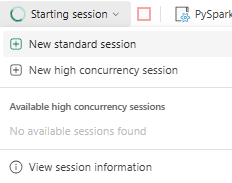

# Identity RAG with Zingg and LangChain

Retrieval-Augmented Generation (RAG) has changed how large language models interact with domain-specific data. But traditional RAG approaches struggle with structured datasets that contain duplicates or name variations.

Zingg solves this by clustering records that represent the same real-world entity before the data reaches the LLM. Each cluster receives a `Z_CLUSTER ID`. The LLM retrieves unified, consistent\
information instead of fragmented duplicates. This approach is called Identity RAG.

### Why identity resolution matters for RAG

Without entity resolution, slight variations in names like "John Doe" vs "Jon Do"; or duplicate records from different source systems cause the retrieval layer to return inconsistent results. The LLM receives fragmented context and provides wrong or incomplete answers.

Zingg clusters all records representing the same entity before they reach the vector store. The retriever finds all of them together. The LLM gives a complete, entity-aware answer.

### How it works



### Step 1: Run Zingg match

Run the Zingg match phase on your dataset. Zingg clusters duplicate records and assigns each cluster a `Z_CLUSTER` in the output CSV.



### Step 2: Import and preprocess

Read the Zingg output CSV. Convert each record into a combined text string and store `Z_CLUSTER` as metadata.



### Step 3: Embed and store

Use an embedding model to create vector representations of each text string. Store them in a vector database with cluster metadata attached.



### Step 4: Build the retrieval chain

Create a `LangChain` retrieval chain that uses the vector store as the retriever and an LLM to generate structured responses.



### Step 5: Query

Invoke the chain with a natural language query. The LLM retrieves top matching records from the vector store and generates a response that respects entity cluster boundaries.



### Import and preprocess Zingg output

```python
import pandas as pd

    df = pd.read_csv("zingg-out.csv")

        def preprocess(row) :text =(f "First Name: {row['FNAME']}, " f "Last Name: {row['LNAME']}, " f "Date of Birth: {row['DOB']}, " f "Address: {row['STNO']} " f "{row['ADD1']}, {row['ADD2']}, " f "{row['AREA_CODE']} " f "{row['STATE']}") metadata = {"cluster" :row["Z_CLUSTER"], "ssn" :row["SSN"], "state" :row["STATE"], "dob" :row["DOB"] } return {"text" :text, "metadata" :metadata }

                                                                                                                                                                                                                                                                                                                                                                 documents =[preprocess(row) for _, row in df.iterrows()]

                                                                                                                                                                                                                                                                                                                                                                                        texts =[doc["text"] for doc in documents] metadatas =[doc["metadata"] for doc in documents]
```


`zingg-out.csv` is your Zingg match output. `Z_CLUSTER` is the resolved entity identifier added\
by Zingg during the match phase. Update the field names (FNAME, LNAME etc.) to match your own schema.&#x20;

**Read more**: For running the match phase - [Run the Match Phase](../running-zingg/run-the-match-phase.md).


<figure><figcaption><p>Preprocess data with entity clustering</p></figcaption></figure>

### Create embeddings and vector store


This example uses Ollama with `nomic-embed-text` and Chroma as the vector store. Replace with your own embedding model and vector database as needed.


```python
from langchain_ollama import OllamaEmbeddings from langchain_chroma import
    Chroma

        embeddings = OllamaEmbeddings(model = "nomic-embed-text")

            vector_store = Chroma.from_texts(
                texts = texts, embedding = embeddings, metadatas = metadatas,
                persist_directory = "./chroma_db")

                               retriever =
                vector_store.as_retriever(search_kwargs = {"k" : 2})
```

<figure><figcaption><p><strong>Embeddings and Vector Store</strong></p></figcaption></figure>

<figure><figcaption><p><strong>Retriever with Cluster Awarenes</strong></p></figcaption></figure>

### Build the LangChain chain

The LangChain chain combines the retriever, an Ollama LLM, a prompt template, and an output parser. The prompt template tells the LLM how to behave. Those instructions are shown below as prose; then the chain itself is shown as Python.

#### **Prompt instructions (paste into your template)**

You are an identity resolution expert. Analyse the cluster information to:

1. Match records based on name, DOB, and other attributes
2. Handle typos and name variations (for example, "Schulz" vs "Schultz")
3. Compare DOBs in YYYY-MM-DD format
4. If no exact match, show closest candidates with differences
5. Always mention Cluster ID and record count

Format the response as:

* Query
* Closest Match
* Cluster ID | Record Count | Match Confidence
* Details (differences between records)

#### **Chain construction**

```python
from langchain_core
    .prompts import ChatPromptTemplate from langchain_ollama import ChatOllama
        from langchain_core
    .runnables import RunnablePassthrough from
        langchain_core.output_parsers import StrOutputParser

    template = "<paste prompt instructions here>"

    prompt = ChatPromptTemplate.from_template(template)
                 llm = ChatOllama(model = "llama3:8b")

        chain = ({"context" : retriever, "question" : RunnablePassthrough()} |
                 prompt | llm | StrOutputParser())
```

<figure><figcaption><p>Prompt engineering for identity resolution</p></figcaption></figure>

<figure><figcaption><p>LangChain integration</p></figcaption></figure>

### Query the chain

#### **Query 1: exact name and DOB match**

The query searches for records related to "benjamin koerbin" born on "19210210" using the identity-aware retrieval system.

```python
response = chain.invoke(
    "Find records of benjamin koerbin "
    "born on 19210210") print(response)
```

<figure><figcaption><p>Query 1 invocation</p></figcaption></figure>

The system successfully retrieves two matching records from the same cluster (Cluster ID 21) with 100% match confidence, confirming both documents correspond to the queried entity without discrepancies. The response shows the query, the closest match, the Cluster ID, record count, match confidence, and that exact matches were found on both name and date of birth.

<figure><figcaption><p>Query 1 output</p></figcaption></figure>


In Query 2 the system identifies the correct cluster even though "`eling`" is a typo for "`eglinton`". Zingg grouped both spellings into the same cluster before the data reached the vector store, so the retriever found all matching records regardless of the variation.


#### **Query 2: typo tolerance with fuzzy matching**

The query searches for records of "jakson eling," which contains a potential typo in the last name.

```json
response = chain.invoke("Find records of jakson eling") print(response)
```

<figure><figcaption><p>Query 2 invocation</p></figcaption></figure>

The system identifies and retrieves three matching records under the same cluster, despite the typo in the query. It correctly maps `eling` to `eglinton` using fuzzy matching, ensuring accurate identity resolution.

<figure><figcaption><p>Query 2 output</p></figcaption></figure>


Zingg grouped both spellings (`eglinton` and `eling`) into the same cluster during the match phase - before the data reached the vector store. The retriever finds all matching records regardless of input variation.


### Use cases

<details>

<summary><strong>Customer service chatbots</strong></summary>

Resolve customer identities across fragmented databases so the chatbot retrieves complete, unified records regardless of how the customer name was entered across different channels.

</details>

<details>

<summary><strong>Healthcare systems</strong></summary>

Link patient records from multiple providers under a single cluster. The LLM retrieves complete patient context rather than fragmented records from different systems.

</details>

<details>

<summary><strong>Financial compliance</strong></summary>

Detect duplicate transactions or accounts for fraud prevention. Zingg clusters related records, and the LLM reasons over a unified entity context.

</details>

<details>

<summary><strong>E-commerce</strong></summary>

Unify customer profiles from different channels for personalized recommendations. The LLM retrieves the complete customer entity rather than individual fragmented records.

</details>


**Read more:**

* For the full Zingg workflow - [How Zingg works](../running-zingg/step-by-step-guide.md)&#x20;
* Download the notebook from the Zingg GitHub repository: `github.com/zinggAI/zingg`

