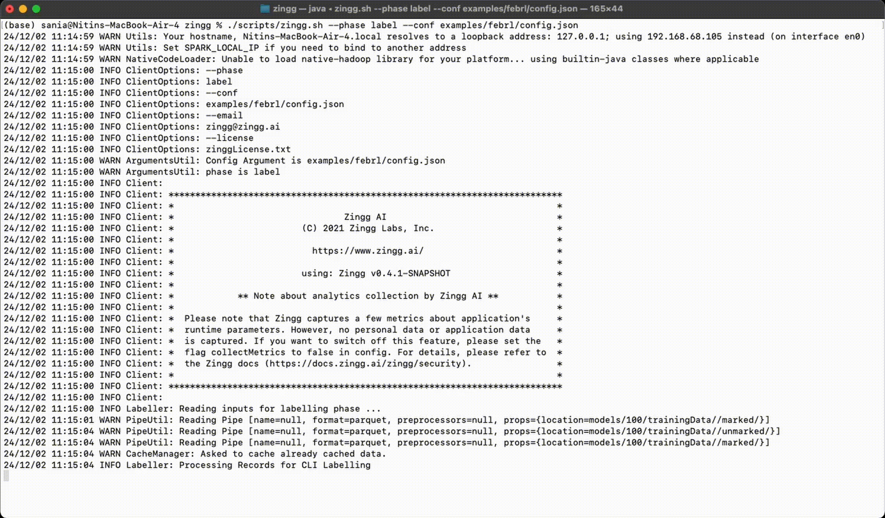

# Labeling Records

The label phase opens an _interactive_ learner where the user can mark the pairs found by **findTrainingData** phase as matches or non-matches. The **findTrainingData** phase generates edge cases for labeling and the label phase helps the user mark them.

`./zingg.sh --phase label --conf config.json <optional --showConcise=true|false>`

Proceed running **findTrainingData** followed by label phases till you have at least 30-40 positives, and when you see the predictions by Zingg converging with the output you want. At each stage, the user will get different variations of attributes across the records. Zingg performs pretty well with even a small number of training, as the samples to be labeled are chosen by the algorithm itself. 

**How much training is enough**
The labelled data is the real configuration for Zingg, through which the different Zingg models get created. Heuristically, 30-40 matching records are a good start before you train and match. Actual numbers vary on the size of data, number of attributes, cluster sizes and performance needs. More training, like going to 500-1000 matches, will surely help with performance on almost any dataset. 
Point to remember here is - Is the effort worth it :smile:

The **showConcise** flag when passed to the Zingg command line only shows fields which are **NOT DONT\_USE**
