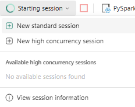

# Data

#### data

An array of input data. Each array entry here refers to a [Zingg Pipe](../../../dataSourcesAndSinks/pipes.md). If the data is self-describing, for e.g. Avro or Parquet, there is no need to define the schema. Else field definitions with names and types need to be provided.

For example, for the CSV under [examples/febrl/test.csv](../../../../examples/febrl/test.csv)



```python
 "data" : [ {
    "name" : "test",
    "format" : "csv",
    "props" : {
      "delimiter" : ",",
      "header" : "true",
      "location" : "examples/febrl/test.csv"
    },
    "schema" : "{
      \"type\":\"struct\",
      \"fields\":[
      {\"name\":\"id\",\"type\":\"string\",\"nullable\":true,\"metadata\":{}},
      {\"name\":\"firstName\",\"type\":\"string\",\"nullable\":true,\"metadata\":{}},
      {\"name\":\"lastName\",\"type\":\"string\",\"nullable\":true,\"metadata\":{}},
      {\"name\":\"streetnumber\",\"type\":\"string\",\"nullable\":true,\"metadata\":{}},
      {\"name\":\"street\",\"type\":\"string\",\"nullable\":true,\"metadata\":{}},
      {\"name\":\"address1\",\"type\":\"string\",\"nullable\":true,\"metadata\":{}},
      {\"name\":\"address2\",\"type\":\"string\",\"nullable\":true,\"metadata\":{}},
      {\"name\":\"areacode\",\"type\":\"string\",\"nullable\":true,\"metadata\":{}},
      {\"name\":\"stateCode\",\"type\":\"string\",\"nullable\":true,\"metadata\":{}},
      {\"name\":\"dateOfbirth\",\"type\":\"string\",\"nullable\":true,\"metadata\":{}},
      {\"name\":\"ssn\",\"type\":\"string\",\"nullable\":true,\"metadata\":{}}
      ]
      }"
  }
```

Read more about Zingg Pipes for datastore connections [here](../../../dataSourcesAndSinks/pipes.md).
