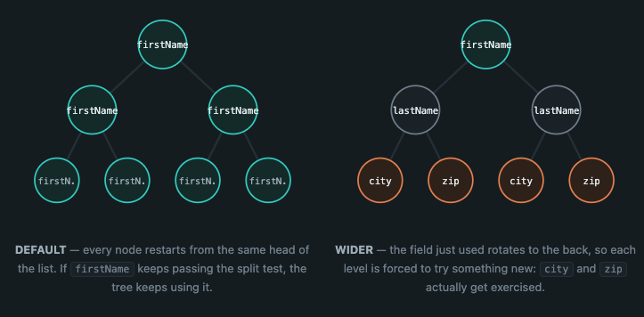

# Blocking Strategies: DEFAULT vs WIDER


**Enterprise only.** Controlled by the `blockingModel` config key (`DEFAULT` or `WIDER`, case-insensitive). If omitted, Zingg uses `DEFAULT`. Community/OSS has no such key - it always behaves like `DEFAULT`.


## What each strategy does

Zingg builds a blocking tree greedily. At every node it asks: _of the eligible field/hash-function combinations, which one splits the group into smaller pieces?_ That combination becomes the split at this node, and the process recurses into each resulting group.

The **strategy** controls only the _order_ candidate fields are offered at each node - never the comparison logic itself:

* **`DEFAULT`** - every node is offered your `fieldDefinition` list in the exact order you configured it. The field listed first is always tried first, everywhere in the tree.
* **`WIDER`** - each node looks at which field its _parent_ node just used, and pushes that field to the back of the candidate list for this node, so the very next field in line gets first consideration instead. This repeats going down the tree, so the field that "won" one level isn't automatically favored again immediately below it.

<figure><figcaption><p>DEFAULT vs WIDER field ordering down the blocking tree</p></figcaption></figure>

## When to use which

<details>

<summary><strong>Use DEFAULT when your fields have very different discriminating power</strong></summary>

If one field (for example, a national ID or a well-populated postcode) is consistently the best splitter for your data, `DEFAULT` lets that field win at every node where it's eligible. This produces a narrower, more predictable tree built around your strongest signal.

</details>

<details>

<summary><strong>Use WIDER when several fields have similar discriminating power</strong></summary>

If your first field only slightly outperforms the second and third (for example, `fname`, `lname`, and `city` all split the data reasonably well), `DEFAULT` can end up leaning on the same field repeatedly down consecutive levels, producing a tree that is deep in one dimension and under-uses the others. `WIDER` forces the next-best field into consideration at the child node, spreading splits across more fields and typically producing a wider, shallower tree.

</details>

<details>

<summary><strong>Use WIDER if verifyBlocking shows large, low-specificity blocks</strong></summary>

Large blocks with `DEFAULT` are a symptom of the tree over-relying on one or two fields. Try `WIDER` and re-run `verifyBlocking` to compare block-size distribution and coverage before committing to the change.

</details>

## Configure

Set `blockingModel` right after `labelDataSampleSize` when building your Enterprise arguments object.



```python
args.setBlockingModel("WIDER")
```



```json
{
  "fieldDefinition": [ ... ],
  "blockingModel": "WIDER"
}
```




**Read more**:

* Set up field definitions and the arguments object this key belongs to → [Configure Zingg](../running-zingg/configure-zingg.md)
* Check block-size distribution and coverage after changing strategy → [Verify Blocking](../running-zingg/create-training-data/verify-blocking.md)
* Blocking model concept and how it fits in the pipeline → [Blocking Model](../zingg-concepts/how-zingg-learns/zingg-models/blocking-model.md)
* Define your own blocking functions for specialized data patterns → [Custom Blocking and Similarity](/broken/pages/DWdyf7az3MmhJaVca3k7)

