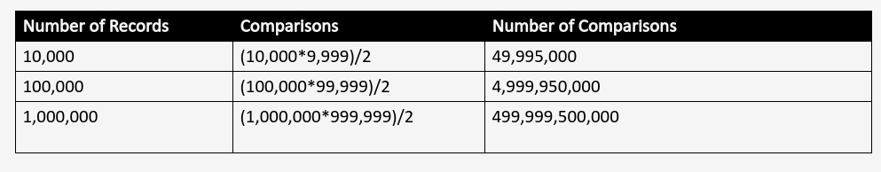
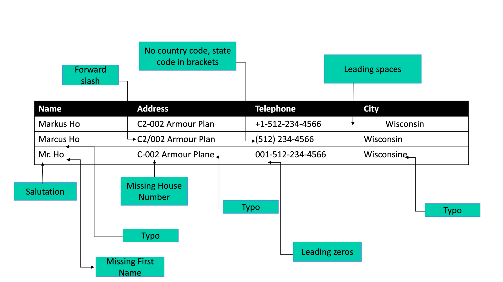
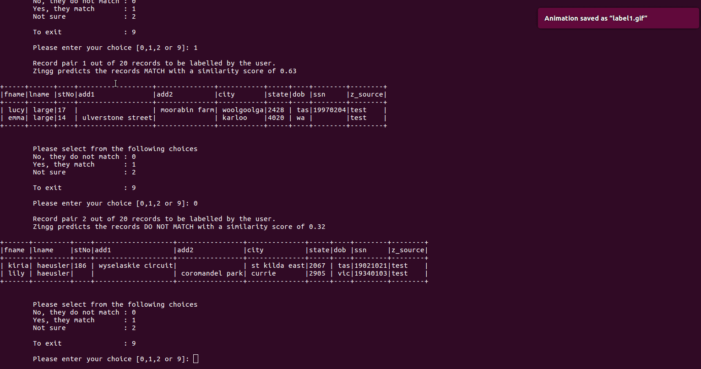

# Zingg Models

Zingg learns two models from the data.

## 1. Blocking Model

One fundamental problem with scaling data mastering is that the number of comparisons increases **quadratically** as the number of input records increases.

Zingg learns a clustering/blocking model which indexes near similar records. This means that Zingg does not compare every record with every other record. Typical Zingg comparisons are **0.05-1%** of the possible problem space.

## 2. Similarity Model

The similarity model helps Zingg to predict which record pairs match. The similarity is run only on records within the same block/cluster to scale the problem to larger datasets. The similarity model is a classifier that predicts the similarity of records that are not exactly the same but could belong together.

To build these models, training data is needed. Zingg comes with an interactive learner to rapidly build training sets.

